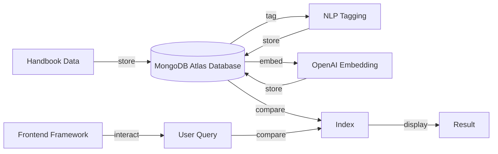
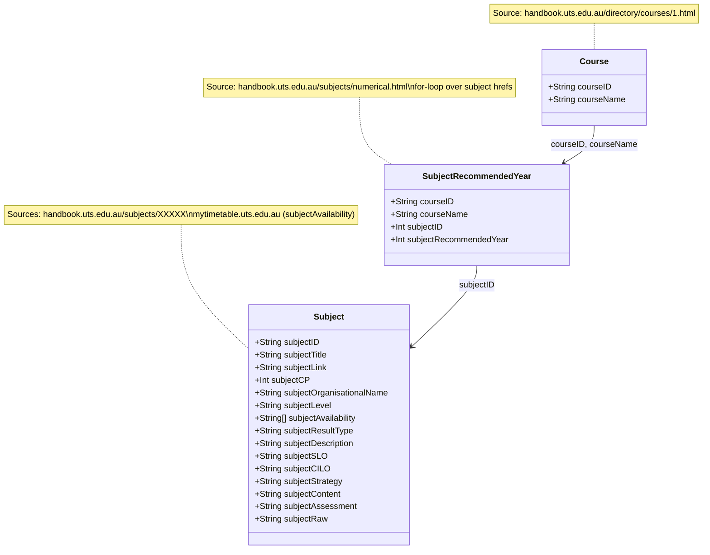

# NLP Course Recommender System

<!--  -->

> *The challenge for undergraduate students at the University of Technology Sydney (UTS) is the difficulty in efficiently navigating and selecting subjects from the extensive and complex curriculum, which often leads to confusion, inefficient decision-making, and reliance on others.*

  

## Introduction

The following project is an implementation of a subject recommender system utilising text mining techniques on on data scraped from the UTS (University of Technology Sydney) Handbook. With a technical focus on Natural Language Processing (NLP) and the focus market of educational institutions, the end users, who are students, often face challenges in navigating large volumes of subject information manually and may miss out on important pieces of information that could negatively influence their enrolment process for subsequent university semesters.

This solution proposes to enhance the accuracy and relevance of subject selections, offering a more tailored and efficient experience for students by semantically matching user search queries against subject details such as subject descriptions, faculty, year level, and type (e.g., elective or core). Within reasonable enrolment criteria, as well as chosen interests, skills, and general identifiers that align with their faculty requirements, subject tags will assist in defining an entire unit through single keywords.

### Objectives
Through providing them with clear, accessible, and personalised academic guidance, the following are generalised objectives the project aims to address:

- To understand and navigate through complex defined subject descriptions
- To find patterns between subject selections and individual or career aspirations through discernments in the student’s degree, major, minor, or general interests (topics, concepts, technologies, etc.).
- To reduce the time and effort required for students to make informed decisions about their subject selections.
- To minimise the liability on academic advisors by providing self-service tools for students.

## Table of Contents
 
3. [Literature Review](#3-literature-review)
4. [System Design](#system-design)
5. [Implementation](#5-implementation)
6. [Evaluation](#6-evaluation)
7. [Results & Discussion](#7-results--discussion)
8. [Limitations & Future Work](#8-limitations--future-work)
9. [Conclusion](#9-conclusion)
10. [References](#10-references)

## System Design

### Architectural Overview

The research design for this project is structured to identify the procedures and flow of thoughts in developing this system over time, with initial considerations into the general architecture, as well as looking into the available tools and skills that can be utilised to increase the efficiency of nuanced ideas considered novel. After laying out these foundations, the collection of subject and course handbook data is a crucial step in following through clearly to lay out the most appropriate ways in which the data is to be both presented and trained through NLP procedures once the corpus is structured, collected, cleaned, and analysed. From a semantic-based perspective, using semantic search algorithms that implement trained embeddings aims to help the student obtain relevant course suggestions at the base level. Extending that interface, the accompaniment of effectively tagging subjects to students based on interests and academics was also to use NLP and regular expression logic obtained from subject data. Below is a simplified system architecture illustrating the general flow of how different components and tools interact:

### Data Collection Techniques
Overall, there were three primary sources or separate scripts from which the data was compiled – from the handbook, where there were 3592 Subject outlines and, at most, 547 Course outlines with recommended course takings. The classes during the sessions were accumulated directly from UTS’ myTimetable service for subject availabilities. These data sources formed the definition of a subject, which would later be used to create tags for each subject, allowing for more precise recommendations and general semantic-based results from queries. For the sake of the architecture and generalised interchangeable definitions, a subject is a specific unit of study within a broader academic discipline. Meanwhile, a course is a broader program of study, which may consist of multiple subjects across a standard four years. This has often conflated the utilisation of academic references in this project, as the use of the word “course” is essentially a subject, in a North American context, an area where most literature in this report is using.
As seen in the table below, most data was segmented for allowing them to be parsed more efficiently for the frontend presentation. However, for the subjectRawString field, this was the entire page source converted into a string. Despite its unclean nature, where several HTML tags, header and footer descriptions remain, this could technically be used for semantic matching when fed into the model.

Below is a table of all data parameters that were extracted from the handbook:

| Parameter | Description |
|---|---|
| `subjectID` | The primary identifier, in numeric values |
| `subjectTitle` | Gives a high-level summary of the subject and often contains key terms that users will search for. Can also be considered a primary identifier from a human-readable perspective |
| `subjectAvailability` | Provides all current classes in the year, dependent on session, class types, class rooms, and class times/dates |
| `subjectCreditPoints` | Points in respect to completing subjects, where the course credit points indicate completion |
| `subjectOrganisationalName` | Faculty and/or department in which the subject belongs under |
| `subjectLevel` | To discern if the subject is either Undergraduate or Postgraduate - for this project, only undergraduate subjects are required |
| `subjectResultType` | How the subject is quantitatively assessed, if it's pass/fail or graded |
| `subjectDescription` | Contains a detailed overview of the subject and is rich with information for semantic understanding. Embedding the description will allow the search to match on a deeper understanding of the subject |
| `subjectSLO` | Explains what students will achieve, making it valuable for matching user queries that are skill or outcome-oriented |
| `subjectCILO` | Like `subjectSLO`, outlines key goals and helps match user queries focused on what they want to gain from the subject |
| `subjectStrategy` | The planned approach employed during the teaching and learning of the subject, through class types and frameworks |
| `subjectContent` | Generally outlines what students will learn and provides a framework for the curriculum |
| `subjectAssessment` | Helps when a user might be searching for subjects based on preferred assessment type (e.g., exams, projects, assignments), which could influence their decision |
| `subjectRawText` | The entire HTML parsed from the web scraper. Serves as a backup retaining other potentially useful information - notably requisite and textbook data, which were difficult to separate during the element classifying process |

### Tech Stack

In context to the eventual solution, below is a detailed description of each component, highlighting its significance and contribution to the overall system architecture. As the system is designed to handle real-world user queries efficiently, there were some monetary costs associated with its production, such as using Microsoft Azure’s student credits to reliably extract large amounts of data from the handbook, as well as powerful embedding and GPT services used on that same data:

| Component Name | Description |
|---|---|
| **Hardware** | Personal Computer |
| | *Azure Virtual Machine Service* - VM Architecture: x64 - Size: Standard D2s v3, 2 vCPUs, 8GiB RAM - Source Image Plan: vs-2019-comm-latest-ws2019 |
| **Database Service** | *MongoDB* - Search Indexing features |
| **Embedding Model Service** | *Hugging Face* - sentence-transformers/all-MiniLM-L6-v2 - SBERT - Free |
| | *OpenAI* - text-embedding-3-large - GPT architecture (specifically an embedding model) - Price: $0.130 / 1M tokens - Price: $0.065 / 1M tokens (Batch API) |
| **Fine-tuning Model Service** | *OpenAI* - gpt-4o-mini - Small model with superior textual intelligence and multimodal reasoning - Price: $0.150 / 1M input tokens - Price: $0.075 / 1M input tokens (Batch API) |
| **Frameworks** | *Scikit-learn* - Python library tools for data mining and data analysis - Used for generating NLP Tags via TF-IDF |
| | *Pandas and NumPy* - Python library for data manipulation and analysis, making it easier to handle structured data such as spreadsheets - Used for Data Handling, Data Manipulation, and Data Cleaning |
| | *Node* (React → Next.js) - For the front-end and client-side rendering - Easy deployment via Vercel |
| **IDE** | Microsoft Visual Studio Code |
| **Version Control Management** | Git (repository stored on GitHub) |
