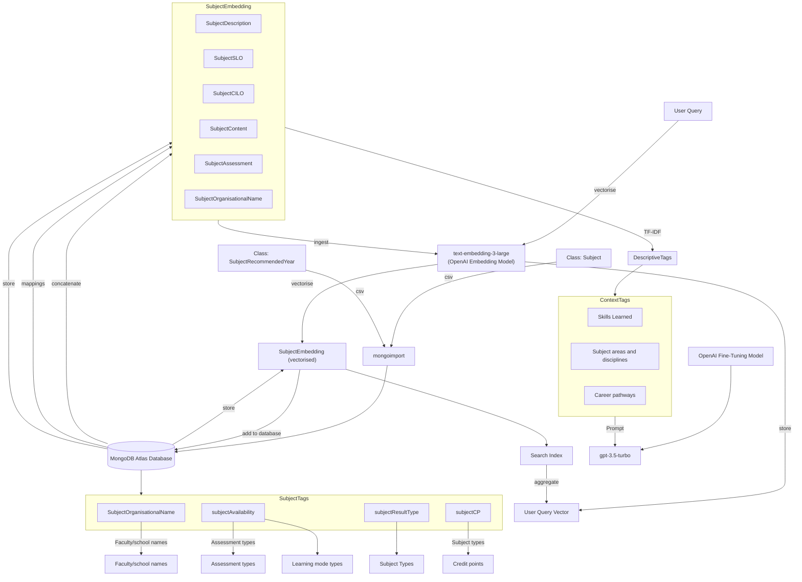
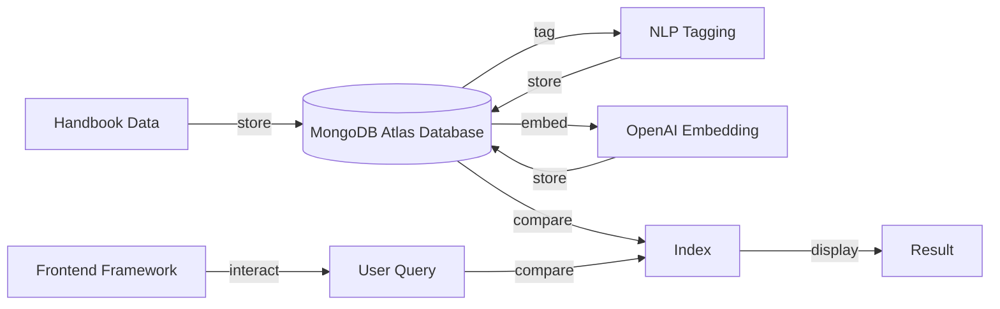
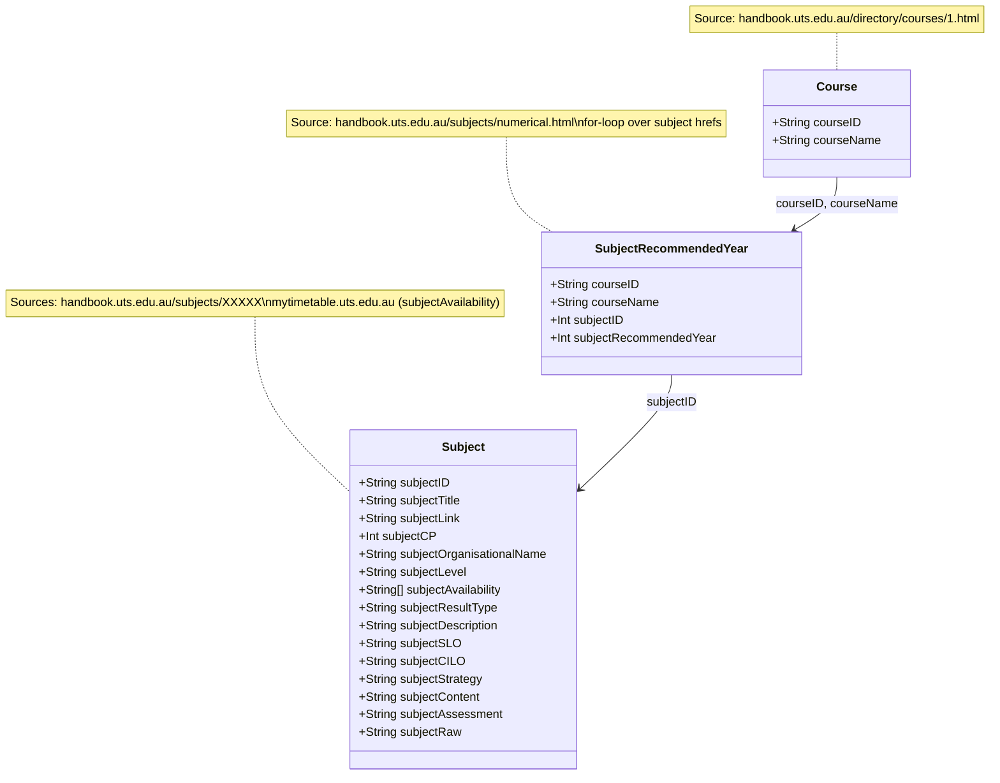

# NLP Course Recommender System

> *The challenge for undergraduate students at the University of Technology Sydney (UTS) is the difficulty in efficiently navigating and selecting subjects from the extensive and complex curriculum, which often leads to confusion, inefficient decision-making, and reliance on others.*

  

| Phase | Date |
| :--- | :--- |
| Project Started | Mar '24 |
| Project Ended | Nov '24 |
| Documentation updated | May '26 |

## Table of Contents
 
1. [Introduction](#1-introduction)
    - [1.1. Objectives](#11-objectives)
2. [Prototyping](#2-prototyping)
    - [2.1. Basic Prototype](#21-basic-prototype)
    - [2.2. Advanced Prototype](#22-advanced-prototype)
3. [System Design](#3-system-design)
    - [3.1. Architectural Overview](#31-architectural-overview)
    - [3.2. Data Collection Techniques](#32-data-collection-techniques)
    - [3.3. Tech Stack](#33-tech-stack)
4. [Results](#4-results)
    - [4.1.	Semantic Comparative Evaluation](#41-semantic-comparative-evaluation)
        - [Comparative Evaluation of Systems on Keywords](/Comparative%20Evaluation%20of%20Systems%20on%20Keywords.md)
    - [4.2. Semantic Mean Reciprocal Rank](#42-semantic-mean-reciprocal-rank)
    - [4.3. Subject Tagging Quantitative Evaluation](#43-subject-tagging-quantitative-evaluation)
        - [4.3.1. Context Tags (GPT)](#431-context-tags-gpt)
        - [4.3.2. Descriptive Tags (TF-IDF)](#432-descriptive-tags-tf-idf)

<!-- 5. [Implementation](#5-implementation)
6. [Evaluation](#6-evaluation)
7. [Results & Discussion](#7-results--discussion)
8. [Limitations & Future Work](#8-limitations--future-work)
9. [Conclusion](#9-conclusion)
10. [References](#10-references) -->

## 1. Introduction

The following project is an implementation of a subject recommender system utilising text mining techniques on on data scraped from the UTS (University of Technology Sydney) Handbook. With a technical focus on Natural Language Processing (NLP) and the focus market of educational institutions, the end users, who are students, often face challenges in navigating large volumes of subject information manually and may miss out on important pieces of information that could negatively influence their enrolment process for subsequent university semesters.

This solution proposes to enhance the accuracy and relevance of subject selections, offering a more tailored and efficient experience for students by semantically matching user search queries against subject details such as subject descriptions, faculty, year level, and type (e.g., elective or core). Within reasonable enrolment criteria, as well as chosen interests, skills, and general identifiers that align with their faculty requirements, subject tags will assist in defining an entire unit through single keywords.

### 1.1. Objectives
Through providing them with clear, accessible, and personalised academic guidance, the following are generalised objectives the project aims to address:

- To understand and navigate through complex defined subject descriptions
- To find patterns between subject selections and individual or career aspirations through discernments in the student’s degree, major, minor, or general interests (topics, concepts, technologies, etc.).
- To reduce the time and effort required for students to make informed decisions about their subject selections.
- To minimise the liability on academic advisors by providing self-service tools for students.

## 2. Prototyping

### 2.1. Basic Prototype

This first prototype was devised to validate and evaluate a query-based "embedding" implementation using minimal inputs. Specifically leveraging the data first provided by the capstone coordinator, the “CASS-MASTER” curriculum data sheet for the year 2020 was used the corpus, with data columns such as each subject’s numeric identifier, title name, credit point value and organisational unit being ingested by a machine-learning model. As the data was assumed to be pre-processed, all the subject data was to go through an SBERT model provided by Hugging Face called the "all-MiniLM-L6-v2", a sentence embedder that aims to understands the context of words in the student’s query. This approach allows for a more intelligent search mechanism compared to index-based search, as it accounts for the meaning and context of the query rather than exact word matches. Conceptually, the data, made up of sentences and paragraphs, are converted by the model into a numeric format in respect to 384-dimensional vector spaces, which are later classified into clusters based on the query sentence, which itself is vectorised. As the training data used by the Hugging Face model exceeds over 1 billion sentence tuples from 32 datasets, the model is promising for a first prototype. In this case, the benefit of implementing SBERTs is that the vector representations of the query can capture relationships between words based on their context within large corpora of text, whether that be grammatically or semantically. After a compressed file is created by the model, a simple web application framework for data visualisation purposes (Python Streamlit) which acts as the general interface for receiving query inputs and outputting the subject outputs along with a confidence score, indicating the strength of the match:

  

### 2.2. Advanced Prototype

With a greater understanding of how semantic-based embedding technologies work, the next stage was to enhance and modularise a new prototype, that would be deployed onto a database. As the database was cleaned and prepared to fit the requirements of a new backend, the csv data was deployed onto MongoDB Atlas (seen imported below), a very reliable and scalable back-end service that has built in Full-Text Search and Vector Searching features, that would prove useful in applying a user query comparison indexing system.

After all the data was consolidated in the backend, the next stage was to embed parts of the existent data, considering combining particular fields, as considered in 3.3 Data Analysis Approach. From the previous prototype, the SBERT all-MiniLM-L6-v2 was used in the initial prototype to generate embeddings. While this model offered acceptable results for the initial development phase, it was time to improve the architecture from modelling and performance perspectives, as low-dimensional representations may fail to reflect the original data's semantics adequately. Conversely, higher dimensions can be used for capturing the full spectrum of semantic meaning; hence, exploring more powerful embedding models from OpenAI was considered, as their machine learning solutions were influential in creating scalable and high-performing embeddings. With that in mind, the table below reflected benchmarking statistics between the previously used embedding model, as well as potential embedding options from OpenAI.

| Rank | Model | Embedding Dimensions | Max Tokens | Average (56 datasets) | Classification Average (12 datasets) | Clustering Average (11 datasets) | Retrieval Average (15 datasets) | STS Average (10 datasets) |
|---|---|---|---|---|---|---|---|---|
| 35 | `text-embedding-3-large` | 3072 | 8191 | 64.59 | 75.45 | 49.01 | 55.44 | 81.73 |
| 80 | `text-embedding-ada-002` | 1536 | 8191 | 60.99 | 70.93 | 45.90 | 49.25 | 80.97 |
| 133 | `all-MiniLM-L6-v2` | 384 | 512 | 56.09 | 62.62 | 41.94 | 41.95 | 78.90 |

The text-embedding-3-large model was eventually selected for this phase of the project due to several advantages over its alternatives, one feature mainly being its embedding dimensionality of 3072, allowing for greater expressiveness and the ability to capture more semantic information without any array size limitations. Additionally, favourable features such as the max tokens allow for the processing of naturally more extensive subject descriptions without truncation, and increased classification ratings are essential for accurately matching subjects to user queries and filtering relevant results. Text-embedding-ada-002 was another considered choice with slightly scoring less than text-embedding-3-large, however, the dimensionality was an essential deciding factor, along with its costs not being much less than the $0.13 USD per 1 million tokens to embed.

The table above shows a general architecture as to how the indexation of the semantic-based system would operate, as well as the integration of subject taggings, which will be discussed in the subsequent section. Generally, the embedding process takes the concatenated subject fields of the Description, Subject learning outcomes, Course-intended learning outcomes, Subject content, Assessments, and the faculty or discipline name and vectorises them using the text-embedding-3-large model. This vectorisation process transforms the textual information into high-dimensional vectors for each subject. Then, those embeddings are stored back into the MongoDB Atlas database under the SubjectEmbedding collection. After that, the search functionality vectorises the latest user query using the same embedding model that generated the subject embeddings. That vector is compared against MongoDB’s internal search index feature, which aggregates the results and compares them with the stored SubjectEmbedding vectors. Finally, it outputs the subjects according to rank results, ensuring that the most semantically relevant subjects are returned in that order.

## 3. System Design

### 3.1. Architectural Overview

The research design for this project is structured to identify the procedures and flow of thoughts in developing this system over time, with initial considerations into the general architecture, as well as looking into the available tools and skills that can be utilised to increase the efficiency of nuanced ideas considered novel. After laying out these foundations, the collection of subject and course handbook data is a crucial step in following through clearly to lay out the most appropriate ways in which the data is to be both presented and trained through NLP procedures once the corpus is structured, collected, cleaned, and analysed. From a semantic-based perspective, using semantic search algorithms that implement trained embeddings aims to help the student obtain relevant course suggestions at the base level. Extending that interface, the accompaniment of effectively tagging subjects to students based on interests and academics was also to use NLP and regular expression logic obtained from subject data. Below is a simplified system architecture illustrating the general flow of how different components and tools interact:

### 3.2. Data Collection Techniques
Overall, there were three primary sources or separate scripts from which the data was compiled – from the handbook, where there were 3592 Subject outlines and, at most, 547 Course outlines with recommended course takings. The classes during the sessions were accumulated directly from UTS’ myTimetable service for subject availabilities. These data sources formed the definition of a subject, which would later be used to create tags for each subject, allowing for more precise recommendations and general semantic-based results from queries. For the sake of the architecture and generalised interchangeable definitions, a subject is a specific unit of study within a broader academic discipline. Meanwhile, a course is a broader program of study, which may consist of multiple subjects across a standard four years. This has often conflated the utilisation of academic references in this project, as the use of the word “course” is essentially a subject, in a North American context, an area where most literature in this report is using.
As seen in the table below, most data was segmented for allowing them to be parsed more efficiently for the frontend presentation. However, for the subjectRawString field, this was the entire page source converted into a string. Despite its unclean nature, where several HTML tags, header and footer descriptions remain, this could technically be used for semantic matching when fed into the model.

Below is a table of all data parameters that were extracted from the handbook:

| Parameter | Description |
|---|---|
| `subjectID` | The primary identifier, in numeric values |
| `subjectTitle` | Gives a high-level summary of the subject and often contains key terms that users will search for. Can also be considered a primary identifier from a human-readable perspective |
| `subjectAvailability` | Provides all current classes in the year, dependent on session, class types, class rooms, and class times/dates |
| `subjectCreditPoints` | Points in respect to completing subjects, where the course credit points indicate completion |
| `subjectOrganisationalName` | Faculty and/or department in which the subject belongs under |
| `subjectLevel` | To discern if the subject is either Undergraduate or Postgraduate - for this project, only undergraduate subjects are required |
| `subjectResultType` | How the subject is quantitatively assessed, if it's pass/fail or graded |
| `subjectDescription` | Contains a detailed overview of the subject and is rich with information for semantic understanding. Embedding the description will allow the search to match on a deeper understanding of the subject |
| `subjectSLO` | Explains what students will achieve, making it valuable for matching user queries that are skill or outcome-oriented |
| `subjectCILO` | Like `subjectSLO`, outlines key goals and helps match user queries focused on what they want to gain from the subject |
| `subjectStrategy` | The planned approach employed during the teaching and learning of the subject, through class types and frameworks |
| `subjectContent` | Generally outlines what students will learn and provides a framework for the curriculum |
| `subjectAssessment` | Helps when a user might be searching for subjects based on preferred assessment type (e.g., exams, projects, assignments), which could influence their decision |
| `subjectRawText` | The entire HTML parsed from the web scraper. Serves as a backup retaining other potentially useful information - notably requisite and textbook data, which were difficult to separate during the element classifying process |

### 3.3. Tech Stack

In context to the eventual solution, below is a detailed description of each component, highlighting its significance and contribution to the overall system architecture. As the system is designed to handle real-world user queries efficiently, there were some monetary costs associated with its production, such as using Microsoft Azure’s student credits to reliably extract large amounts of data from the handbook, as well as powerful embedding and GPT services used on that same data:

| Component Name | Description |
|---|---|
| **Hardware** | Personal Computer |
| | *Azure Virtual Machine Service* - VM Architecture: x64 - Size: Standard D2s v3, 2 vCPUs, 8GiB RAM - Source Image Plan: vs-2019-comm-latest-ws2019 |
| **Database Service** | *MongoDB* - Search Indexing features |
| **Embedding Model Service** | *Hugging Face* - sentence-transformers/all-MiniLM-L6-v2 - SBERT - Free |
| | *OpenAI* - text-embedding-3-large - GPT architecture (specifically an embedding model) - Price: $0.130 / 1M tokens - Price: $0.065 / 1M tokens (Batch API) |
| **Fine-tuning Model Service** | *OpenAI* - gpt-4o-mini - Small model with superior textual intelligence and multimodal reasoning - Price: $0.150 / 1M input tokens - Price: $0.075 / 1M input tokens (Batch API) |
| **Frameworks** | *Scikit-learn* - Python library tools for data mining and data analysis - Used for generating NLP Tags via TF-IDF |
| | *Pandas and NumPy* - Python library for data manipulation and analysis, making it easier to handle structured data such as spreadsheets - Used for Data Handling, Data Manipulation, and Data Cleaning |
| | *Node* (React → Next.js) - For the front-end and client-side rendering - Easy deployment via Vercel |
| **IDE** | Microsoft Visual Studio Code |
| **Version Control Management** | Git (repository stored on GitHub) |

## 4. Results

### 4.1. Semantic Comparative Evaluation
As a quantitative method for evaluating the results of the Recommendation System, comparing the performance of it against a baseline approach would allow this to highlight the improvements that the developed system offers. In this case, where the comparative is the search bar at the top of the existing handbook navigator for subjects, outlining a keyword-based recommendation approach as a metric for comparison will judge the performance of the two systems. Based on my verdict as a student, with my university experiences and technological knowledge I have learnt from the years, I will determine the relevance of each subject in relation to the user queries. Deciding whether subjects are either relevant or non-relevant, a superscript ‘N’ next to the subject ID in the table will indicate non-relevant subjects, and hence affect the subsequent metrics used to quantify success in this project; being the only qualitative instigator in these results. Additionally, relevance scores, for calculating the Normalised Discounted Cumulative Gain (NDCG) will be subscripted based on the following comments:

| Relevance Score | Definition |
|---|---|
| 0 or N | The subject has no relevance to the keyword |
| 1 | The subject has little relevance to the keyword |
| 2 | The subject has some relevance to the keyword |
| 3 | The subject has high relevance to the keyword |

The markdown page below will outline the Top 20 results for 10 keywords on both systems:

- [Comparative Evaluation of Systems on Keywords](/Comparative%20Evaluation%20of%20Systems%20on%20Keywords.md)

To outline some metrics in quantifying the success of the system, the precision score is used to measure how accurate the positive predictions are made by the model, which can be useful in filtering false positives, which is a what is being tested for particularly for the recommendation system, as subjects out of disciplinary scope should not be returned to the results. The Top 10 and Top 20 precision scores will be calculated to evaluate if the drop off for ranked results diminishes in terms of confidence scores.

$$ \text{Precision}@N = \frac{\text{Number of relevant items in top } N \text{ results}}{N} $$

The NDCG is another metric used to calculate the performance of ranking systems, particularly measuring relevance of results against a scale, defined in Table 5: Relevance score and definitions. Dealing with a 3-point scale system, subjects in higher rankings are given more weighting that those in lower rankings, and the value is calculated by dividing an array of this (Discounted Cumulative Gain) over the same list rearranged through an ideal ranking. Additionally, the higher the value (between 0 and 1), the more relevant the ranking system is.

$$ \text{NDCG at position 20} = \frac{DCG \text{ at position } p}{IDCG \text{ at position } p} $$

$$ DCG = \sum_{i=1}^{3} \frac{rel_i}{\log_2(i + 1)} $$

$$ IDCG = \sum_{i=1}^{3} \frac{rel_i^{ideal}}{\log_2(i + 1)} $$

The following table below will display the top 10 precision values, the top 20 Precision values, the Reciprocal Rank, the Normalized Discounted Cumulative Gain, and the average confidence score rendered on the frontend after typing:

| User Query | System | 10th Precision | 20th Precision | RR | NDCG@20 | Avg. Confidence Score |
| :--- | :--- | :--- | :--- | :--- | :--- | :--- |
| **software engineering** | Recommendation System | 0.8 | 0.75 | 1st | 0.93815129 | 0.694842 |
| **software engineering** | UTS Handbook Search | 0.3 | 0.35 | 1st | 0.71366880 | N/A |
| **agile development methodology** | Recommendation System | 0.6 | 0.65 | 1st | 0.91586463 | 0.650186 |
| **agile development methodology** | UTS Handbook Search | 0.1 | 0.05 | 2nd | 0.63092975 | N/A |
| **database architecture** | Recommendation System | 0.6 | 0.5 | 3rd | 0.67524839 | 0.665006 |
| **database architecture** | UTS Handbook Search | 0.2 | 0.1 | 5th | 0.43062412 | N/A |
| **cloud architect** | Recommendation System | 0.7 | 0.5 | 1st | 0.92278680 | 0.670093 |
| **cloud architect** | UTS Handbook Search | 0.3 | 0.2 | 2nd | 0.63994202 | N/A |
| **data visualisation** | Recommendation System | 0.6 | 0.35 | 1st | 0.74770159 | 0.717455 |
| **data visualisation** | UTS Handbook Search | 0.5 | 0.3 | 3rd | 0.62859556 | N/A |
| **machine learning** | Recommendation System | 0.8 | 0.75 | 1st | 0.90995253 | 0.691141 |
| **machine learning** | UTS Handbook Search | 0.7 | 0.4 | 1st | 0.89895782 | N/A |
| **design innovative software...** | Recommendation System | 0.8 | 0.8 | 1st | 0.91417479 | 0.701567 |
| **design innovative software...** | UTS Handbook Search | 0.3 | 0.2 | 1st | 0.90313942 | N/A |
| **cybersecurity** | Recommendation System | 0.7 | 0.7 | 2nd | 0.77942325 | 0.714134 |
| **cybersecurity** | UTS Handbook Search | 0.7 | 0.45 | 1st | 0.87999528 | N/A |
| **object-oriented programming** | Recommendation System | 0.7 | 0.6 | 1st | 0.85246351 | 0.650659 |
| **object-oriented programming** | UTS Handbook Search | 0 | 0.1 | 11th | 0.33672885 | N/A |
| **network infrastructure** | Recommendation System | 0.4 | 0.45 | 1st | 0.71212851 | 0.674076 |
| **network infrastructure** | UTS Handbook Search | 0.2 | 0.3 | 1st | 0.52481376 | N/A |

### 4.2. Semantic Mean Reciprocal Rank

MRR on the other hand can be used to evaluate the performance on a ranked-based result through summating an inversed representation of relevant ranks. Where it is evaluated from 0 to 1, higher values tend to demonstrate greater relevancy for subjects against user queries.

$$ MRR = \frac{1}{|Q|} \sum_{i=1}^{|Q|} \frac{1}{rank_i} $$

From 10 Reciprocal Ranking values across the two systems on [Comparative Evaluation of Systems on Keywords](/Comparative%20Evaluation%20of%20Systems%20on%20Keywords.md) against Ranking results, the MRR for the Recommendation System was `0.883` and the UTS Handbook Search System was `0.6624`.

### 4.3. Subject Tagging Quantitative Evaluation

The exact process for semantic-based results was applied here, with an additional focus on evaluating the relevance of the generated tags. A familiar subject (taken during the last 2 years of study) was selected to carry out this evaluation, helping determine if the tags were either relevant or non-relevant to the subject's content and context.

An additional metric was also added for the TF-IDF tags, to assess the model's ability in generating relevant tags, called the recall. This score helps ensure that the system captures all the potential tags related to a subject, highlighting any tags that might have been missed. Along with that, the F1 score was also calculated to provide a balanced measure of the system's precision and recall, which was just the harmonic mean of both of these scores, making it a more comprehensive measure of tag generation performance. For definition, the number of correct possible tags are tags that have filtered out non-contextual words (i.e. spam), and the number of correct tags are tags that are contextually relevant to the subject.

$$ \text{Recall} = \frac{\text{No. of correct tags}}{\text{Total no. of possible correct tags}} $$

$$ F1 = 2 \times \frac{\text{Precision} \times \text{Recall}}{\text{Precision} + \text{Recall}} $$

#### 4.3.1. Context Tags (GPT)

| Subject Title | No. of Correct Tags | No. of Tags Generated | Precision |
| :--- | :---: | :---: | :---: |
| Software Architecture | 11 | 15 | 0.73 |
| Economics and Finance for Engineering Projects | 13 | 15 | 0.86 |
| Software Analysis Studio | 16 | 16 | 1 |
| Real-time Operating Systems | 15 | 16 | 0.94 |
| Engineering Project Management | 14 | 15 | 0.93 |
| Software Development Studio | 12 | 15 | 0.8 |
| Introductory Embedded Systems | 15 | 15 | 1 |
| Entrepreneurship and Commercialisation | 14 | 15 | 0.93 |
| Cybersecurity | 16 | 17 | 0.94 |
| Software Innovation Studio | 14 | 15 | 0.93 |

#### 4.3.2. Descriptive Tags (TF-IDF)

| Subject Title | No. of Correct Possible Tags | No. of Correct Tags | No. of Tags Generated | Precision | Recall | F1 Score |
| :--- | :---: | :---: | :---: | :---: | :---: | :---: |
| Software Architecture | 19 | 2 | 20 | 0.95 | 0.105 | 0.1891 |
| Economics and Finance for Engineering Projects | 19 | 5 | 20 | 0.95 | 0.263 | 0.411954 |
| Software Analysis Studio | 17 | 3 | 20 | 0.85 | 0.176 | 0.291618 |
| Real-time Operating Systems | 19 | 5 | 20 | 0.95 | 0.263 | 0.411954 |
| Engineering Project Management | 17 | 3 | 20 | 0.85 | 0.176 | 0.291618 |
| Software Development Studio | 17 | 2 | 20 | 0.85 | 0.118 | 0.207231 |
| Introductory Embedded Systems | 18 | 2 | 20 | 0.9 | 0.111 | 0.197626 |
| Entrepreneurship and Commercialisation | 16 | 2 | 20 | 0.8 | 0.125 | 0.216216 |
| Cybersecurity | 19 | 3 | 20 | 0.95 | 0.158 | 0.270939 |
| Software Innovation Studio | 18 | 5 | 20 | 0.9 | 0.278 | 0.424788 |
